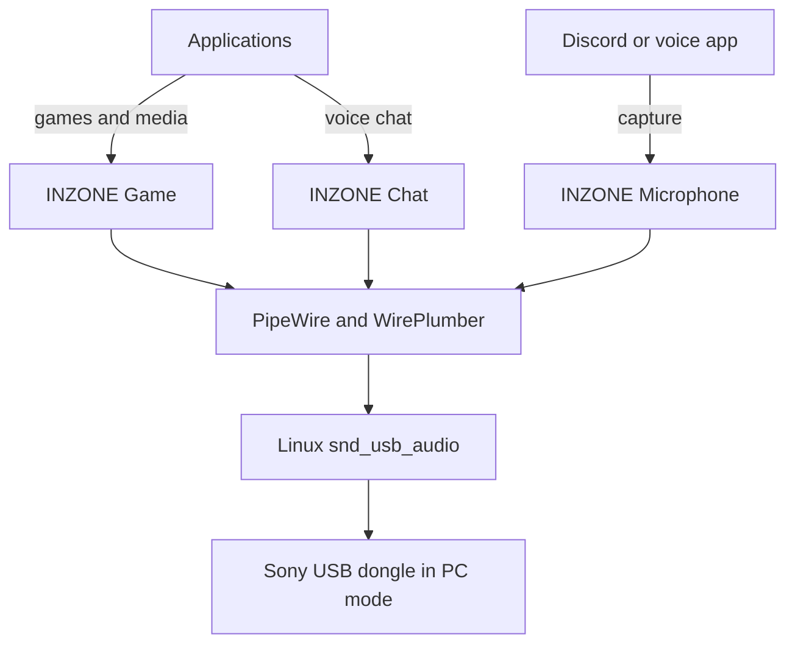

# Architecture

Sony's PC-mode USB dongle already exposes separate Game, Chat and Microphone
audio endpoints. Linux's `snd_usb_audio` driver recognizes them without a
device-specific kernel module. The missing piece is desktop integration.

This project adds that integration in userspace:

## Components

### Kernel and ALSA

The standard `snd_usb_audio` module creates an ALSA card for the dongle. The
card number is assigned dynamically and is therefore never hard-coded by this
project.

### PipeWire

PipeWire exposes the ALSA devices as graph nodes. With the card's `pro-audio`
profile active, all three native endpoints are available concurrently.

### WirePlumber

The configuration fragment in
`config/wireplumber/51-inzone-buds.conf` matches the stable USB component ID
`USB054c:0ec2` and the Pro Audio node suffixes. It assigns friendly endpoint
descriptions and selection priorities without changing stable node names.

The same fragment adds a `device.profile.priority.rules` entry for USB ID
`054c:0ec2`, so WirePlumber creates the card directly in `pro-audio` instead of
starting the analog profile first. A profile the user saved explicitly still
takes precedence. WirePlumber releases without this section ignore it.

### Hot-plug service

`inzone-autoswitch` subscribes to PulseAudio-compatible PipeWire events. When
the PC-mode dongle appears, it:

1. activates `pro-audio` if WirePlumber has not already selected it;
2. waits for the Game, Chat and Microphone nodes;
3. selects Game as the default output;
4. selects the INZONE microphone as the default input.

It does nothing to fallback devices when the dongle is removed. WirePlumber can
therefore select the next available device normally.

The daemon tracks whether the Game node was previously available. It does not
continually override a manual device selection while the dongle remains
connected.

#### Volume linking

Desktop volume and mute keys act only on the default output. The daemon
watches sink changes and, once a burst of events has settled (150 ms), mirrors
a change that affected only Game or only Chat onto the other endpoint:

- volume is scaled from a fixed Game/Chat reference pair, in raw PulseAudio
  units, so rounding does not accumulate and the balance survives a trip
  through zero volume; the louder endpoint is capped at 100%;
- mute is copied to the other endpoint;
- a change to both endpoints at once is a balance change and becomes the new
  reference;
- `inzonectl` writes a timestamp to
  `$XDG_RUNTIME_DIR/inzone-buds-manual-change` before changing Game or Chat
  volume. Changes within one second of it are deliberate: they become the new
  reference and are not mirrored;
- for two seconds after the dongle appears, volumes restored by WirePlumber are
  adopted as the reference instead of being mirrored.

Set `INZONE_LINK_VOLUMES=0` in the service environment to disable linking.

#### Connect/disconnect notifications

`inzone-autoswitch` calls `notify-send` when the Game/Chat endpoints appear or
disappear while it is running, not on its own startup. Missing `notify-send`
is silently ignored. Set `INZONE_NOTIFY=0` in the service environment to
disable notifications.

### Command-line controller

`inzonectl` resolves endpoints by stable PipeWire node suffix rather than by
numeric object or ALSA card IDs. It provides profile selection, default-device
selection, endpoint volume, balance, status and local diagnostics.

## Balance model

The balance value runs from 0 through 100:

| Position | Game | Chat |
| ---: | ---: | ---: |
| 0 | muted | maximum |
| 25 | 50% of maximum | maximum |
| 50 | maximum | maximum |
| 75 | maximum | 50% of maximum |
| 100 | maximum | muted |

The optional maximum-volume argument limits both endpoints. This avoids a
balance change unexpectedly raising either endpoint above that ceiling.

## Design boundaries

The project does not create virtual sinks or mix Game and Chat in software. The
dongle accepts both native playback streams concurrently, so preserving that
hardware path is simpler and avoids unnecessary resampling and latency.

Proprietary non-audio controls are intentionally kept separate from the audio
integration. Future HID work must be based on repeatable captures and hardware
testing.
