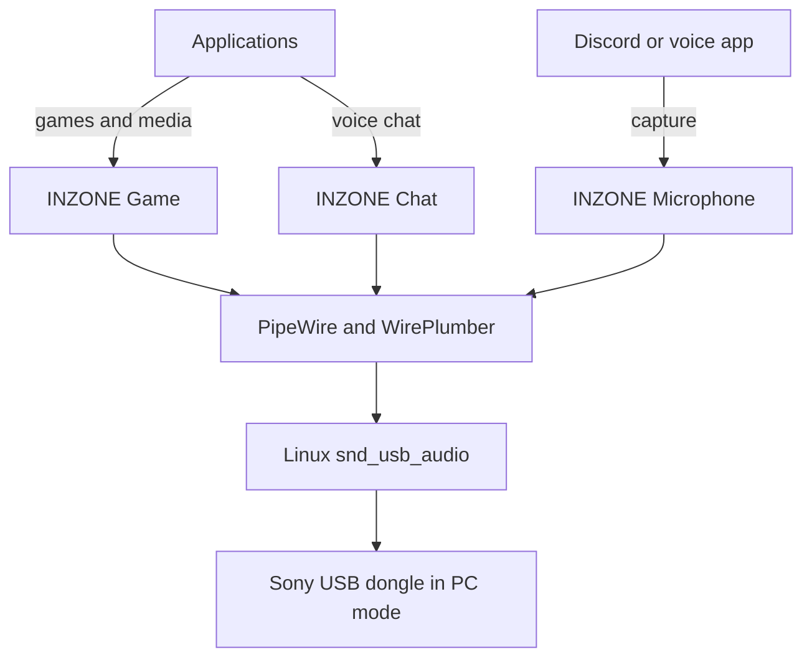

# Architecture

Sony's PC-mode USB dongle already exposes separate Game, Chat and Microphone
audio endpoints. Linux's `snd_usb_audio` driver recognizes them without a
device-specific kernel module. The missing piece is desktop integration.

This project adds that integration in userspace:

## Components

### Kernel and ALSA

The standard `snd_usb_audio` module creates an ALSA card for the dongle. The
card number is assigned dynamically and is therefore never hard-coded by this
project.

### PipeWire

PipeWire exposes the ALSA devices as graph nodes. With the card's `pro-audio`
profile active, all three native endpoints are available concurrently.

### WirePlumber

The configuration fragment in
`config/wireplumber/51-inzone-buds.conf` matches the stable USB component ID
`USB054c:0ec2` and the Pro Audio node suffixes. It assigns friendly endpoint
descriptions and selection priorities without changing stable node names.

### Hot-plug service

`inzone-autoswitch` subscribes to PulseAudio-compatible PipeWire events. When
the PC-mode dongle appears, it:

1. activates `pro-audio`;
2. waits for the Game, Chat and Microphone nodes;
3. selects Game as the default output;
4. selects the INZONE microphone as the default input.

It does nothing to fallback devices when the dongle is removed. WirePlumber can
therefore select the next available device normally.

The daemon tracks whether the Game node was previously available. It does not
continually override a manual device selection while the dongle remains
connected.

### Command-line controller

`inzonectl` resolves endpoints by stable PipeWire node suffix rather than by
numeric object or ALSA card IDs. It provides profile selection, default-device
selection, endpoint volume, balance, status and local diagnostics.

## Balance model

The balance value runs from 0 through 100:

| Position | Game | Chat |
| ---: | ---: | ---: |
| 0 | muted | maximum |
| 25 | 50% of maximum | maximum |
| 50 | maximum | maximum |
| 75 | maximum | 50% of maximum |
| 100 | maximum | muted |

The optional maximum-volume argument limits both endpoints. This avoids a
balance change unexpectedly raising either endpoint above that ceiling.

## Design boundaries

The project does not create virtual sinks or mix Game and Chat in software. The
dongle accepts both native playback streams concurrently, so preserving that
hardware path is simpler and avoids unnecessary resampling and latency.

Proprietary non-audio controls are intentionally kept separate from the audio
integration. Future HID work must be based on repeatable captures and hardware
testing.
